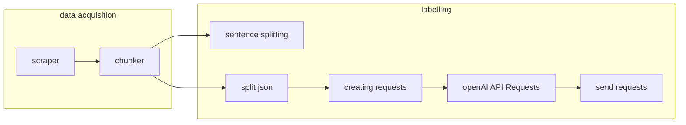

```mermaid
graph LR 
    subgraph "data acquisition"  
        A[scraper]
        B[chunker]
        A --> B
    end
    subgraph labelling
        C[sentence splitting]
        D[split json]
        E[creating requests]
        F[openAI API Requests]
        G[send requests]
        B --> C
        B --> D 
        D --> E
        E --> F 
        F --> G
    end 
```
