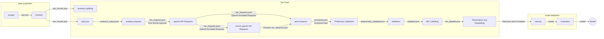

```mermaid
graph LR 
    subgraph "data acquisition"  
        Scraper[scraper]
        Chunker[chunker]
        Scraper -->|raw text| Chunker
    end
    subgraph labelling [Top Down]
        direction TB
        Sentence_Splitting[sentence splitting]
        Split_JSON[split json]
        Creating_Requests[creating requests]
        Open_API_Requests[openAI API Requests]
        Chunk_Open_API[Chunk openAI API Requests]
        Send_Requests[send requests]
        Preliminary_Validation[Preliminary Validation]
        Validation[Validation]
        BIO_Labels[BIO Labelling]
        TaR[Tokenization and Relabelling]
        Chunker -->|raw_chunks.json| Sentence_Splitting
        Chunker -->|raw_chunks.json|Split_JSON
        Split_JSON -->|sentence_output.json|Creating_Requests
        Creating_Requests -->|ner_requests.json <br> Free format requests|Open_API_Requests
        Open_API_Requests -->|ner_requests.jsonl <br> OpenAI formatted Requests| Send_Requests
        Open_API_Requests -->|ner_requests.jsonl <br> OpenAI formatted Requests|Chunk_Open_API
        Chunk_Open_API --> |Chunker ner_requests.jsonl| Send_Requests
        Send_Requests -->|answered.jsonl <br> Answered Data| Preliminary_Validation
        Preliminary_Validation -->|preliminarily_validated.json|Validation
        Validation -->|validated.json|BIO_Labels
        BIO_Labels --> |bio_labelled.json| TaR

    end 
    subgraph "model distillation" 
        Training[training]
        Evaluation[evaluation]
        TaR --> |Tokenized and Formatted| Training 
        Training -->|model| Evaluation
    end
    Model((Model!))
    Evaluation --> |model!| Model
```
