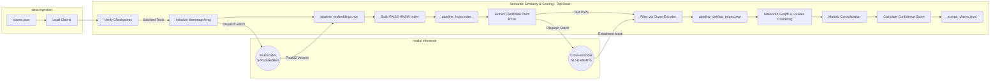

```mermaid
graph LR
    subgraph "data ingestion"
        Input[claims.json]
        Load[Load Claims]
        Input --> Load
    end
    
    subgraph Part 1 [Semantic Similarity & Scoring - Top Down]
        direction TB
        Check_Checkpoint[Verify Checkpoints]
        Memmap[Initialize Memmap Array]
        Save_Embed[pipeline_embeddings.npy]
        FAISS_Index[Build FAISS HNSW Index]
        Index_File[pipeline_hnsw.index]
        Candidate_Pairs[Extract Candidate Pairs <br> K=20]
        Filter_Pairs[Filter via Cross-Encoder]
        Verified_Edges[pipeline_verified_edges.json]
        Graph_Clustering[NetworkX Graph & Louvain Clustering]
        Medoid[Medoid Consolidation]
        Confidence[Calculate Confidence Score]
        Output_JSONL[scored_claims.jsonl]
        
        Load --> Check_Checkpoint
        Check_Checkpoint --> |Batched Texts| Memmap
        Memmap --> Save_Embed
        Save_Embed --> FAISS_Index
        FAISS_Index --> Index_File
        Index_File --> Candidate_Pairs
        Candidate_Pairs --> |Text Pairs| Filter_Pairs
        Filter_Pairs --> Verified_Edges
        Verified_Edges --> Graph_Clustering
        Graph_Clustering --> Medoid
        Medoid --> Confidence
        Confidence --> Output_JSONL
    end
    
    subgraph "modal inference"
        BiEncoder((Bi-Encoder <br> S-PubMedBert))
        CrossEncoder((Cross-Encoder <br> NLI-DeBERTa))
        
        Memmap --> |Dispatch Batch| BiEncoder
        BiEncoder --> |Float32 Vectors| Save_Embed
        
        Candidate_Pairs --> |Dispatch Batch| CrossEncoder
        CrossEncoder --> |Entailment Mask| Filter_Pairs
    end
```
