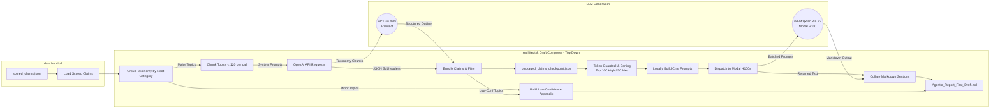

```mermaid
graph LR
    subgraph "data handoff"
        Input2[scored_claims.jsonl]
        Load2[Load Scored Claims]
        Input2 --> Load2
    end
    
    subgraph phase2_3 [Architect & Draft Composer - Top Down]
        direction TB
        Group_Taxonomy[Group Taxonomy by Root Category]
        Chunk_Topics[Chunk Topics < 120 per call]
        OpenAI_API[OpenAI API Requests]
        Package_Claims[Bundle Claims & Filter]
        Checkpoint[packaged_claims_checkpoint.json]
        
        Token_Guardrail[Token Guardrail & Sorting <br> Top 100 High / 50 Med]
        Build_Prompts[Locally Build Chat Prompts]
        Dispatch_Batches[Dispatch to Modal H100s]
        
        Collation[Collate Markdown Sections]
        Appendix[Build Low-Confidence Appendix]
        Final_Draft[Agentic_Report_First_Draft.md]
        
        Load2 --> Group_Taxonomy
        Group_Taxonomy --> |Major Topics| Chunk_Topics
        Chunk_Topics --> |System Prompts| OpenAI_API
        OpenAI_API --> |JSON Subheaders| Package_Claims
        Package_Claims --> Checkpoint
        
        Checkpoint --> Token_Guardrail
        Token_Guardrail --> Build_Prompts
        Build_Prompts --> Dispatch_Batches
        
        Dispatch_Batches --> |Returned Text| Collation
        Group_Taxonomy --> |Minor Topics| Appendix
        Package_Claims --> |Low-Conf Topics| Appendix
        Collation --> Final_Draft
        Appendix --> Final_Draft
    end
    
    subgraph "LLM Generation"
        GPT4o((GPT-4o-mini <br> Architect))
        vLLM((vLLM Qwen 2.5 7B <br> Modal H100))
        
        OpenAI_API --> |Taxonomy Chunks| GPT4o
        GPT4o --> |Structured Outline| Package_Claims
        
        Dispatch_Batches --> |Batched Prompts| vLLM
        vLLM --> |Markdown Output| Collation
    end
```
